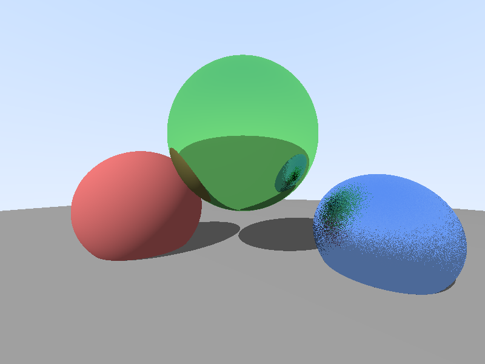
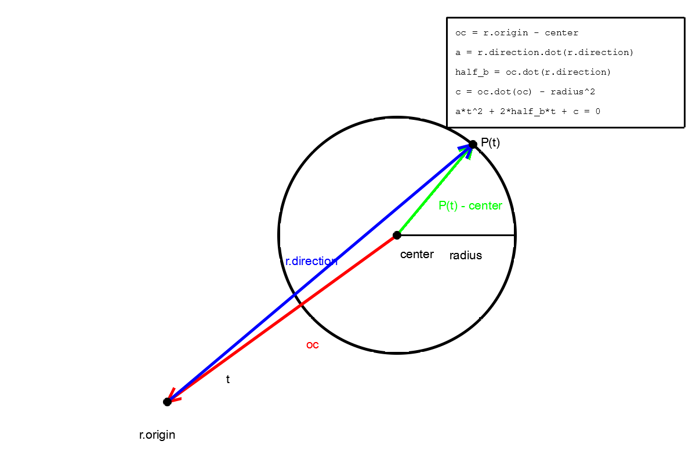

# rust-gpu-rendering 🦀

A from-scratch ray tracer and GPU compute-shader engine in Rust, built as a deep-dive learning project. 

The project features a cleanly architected CPU path tracer capable of rendering shaded, reflective spheres with global illumination, alongside a parallel GPU compute pipeline built with `wgpu` and WGSL.



---

## ✨ Capabilities

### CPU Path Tracer (`src/render/`)
* **Physically Based Materials:** Ideal Diffuse (Lambertian) and Rough Metal (with configurable micro-surface fuzz).
* **Lighting & Shadows:** Directional light with toggleable hard shadow rays.
* **Global Illumination:** Toggleable true diffuse light scattering, enabling color bleeding and indirect illumination.
* **The Control Panel (`RenderConfig`):** A centralized configuration struct to toggle shadows, max bounce depth, global illumination, and samples-per-pixel without touching the integrator code.
* **Framebuffer Abstraction:** Clean separation between linear-light rendering and image encoding (with built-in gamma correction).

### GPU Compute Pipeline (`examples/gpu_*`)
* **wgpu 30 Integration:** Headless compute-shader setup (Instance, Adapter, Device, Queue, Storage Buffers).
* **WGSL Shaders:** Ray-sphere intersection math and shading models translated directly to WebGPU Shading Language.
* **Massive Parallelism:** One GPU thread per pixel using 16x16 workgroup tiles.

### Architecture (`src/`)
* **`math`**: Pure, dependency-free linear algebra (`Vec3`, `Ray`, `reflect`) and a 3D rejection-sampling RNG engine.
* **`scene`**: Pure world data (`Sphere`, `Camera`, `Material`).
* **`colors`**: Shared palette and linear-to-sRGB conversion utilities.
* **`render`**: The engine (Integrator, BRDFs/Shading, Framebuffer, Config).

---

## 📦 Project Structure

```text
rust-gpu-rendering/
├── Cargo.toml
├── README.md                  # You are here
├── images/                    # Diagrams and rendered screenshots
├── src/
│   ├── lib.rs                 # Exposes the modules
│   ├── math.rs                # Linear algebra + RNG engine
│   ├── scene.rs               # World objects: Sphere, Camera, Material
│   ├── colors.rs              # Named palette + Color -> RGBA8 (with gamma)
│   └── render/
│       ├── mod.rs             # Module wiring
│       ├── config.rs          # RenderConfig: the control panel
│       ├── cpu.rs             # The CPU integrator (bounce loop, tracing)
│       ├── framebuffer.rs     # Output abstraction (pixels + gamma)
│       └── shading.rs         # BRDFs (Lambert, Metal reflect, Diffuse scatter)
└── examples/
    ├── README.md              # Per-example docs & experiments
    ├── ascii_sphere.rs        # One sphere, terminal output
    ├── ascii_spheres.rs       # Multiple spheres, closest-hit loop
    ├── png_spheres.rs         # Full CPU path tracer + control panel
    ├── diagram_ray_sphere.rs  # Regenerates the math diagram (plotters)
    ├── gpu_gradient.rs        # wgpu "Hello World" compute shader
    └── gpu_sphere.rs          # wgpu ray-sphere intersection in WGSL
```

---

## 🚀 How to run

Requirements: a Rust toolchain ([rustup.rs](https://rustup.rs)). A Vulkan/DirectX/Metal compatible GPU is required for the `gpu_*` examples.

```bash
# CPU Renderers
cargo run --example ascii_sphere        # Terminal rendering
cargo run --example ascii_spheres       # Multiple spheres (closest-hit loop)
cargo run --example png_spheres         # Full path tracer -> output.png

# GPU Compute Renderers
cargo run --example gpu_gradient        # Minimal wgpu compute shader -> gpu_gradient.png
cargo run --example gpu_sphere          # Ray tracing in WGSL -> gpu_sphere.png

# Utilities
cargo run --example diagram_ray_sphere  # Regenerates the math diagram
cargo test                              # Run all library unit tests
```

---

## 📐 The math: ray–sphere intersection



### 1. The core geometric rule

Every point on a sphere's surface is exactly `radius` away from `center`.
So if the ray hits the sphere at `P(t)`:

```text
length(P(t) - center) = radius
```

Squaring both sides (a vector dotted with itself is its squared length,
which avoids a square root):

```text
dot(P(t) - center, P(t) - center) = radius^2
```

### 2. Substitute the ray equation

A point on the ray is `P(t) = r.origin + t * r.direction`.
Define the vector from the sphere center to the ray origin:

```text
oc = r.origin - center
```

Then:

```text
P(t) - center = oc + t * r.direction
```

Substituting:

```text
dot(oc + t * r.direction, oc + t * r.direction) = radius^2
```

### 3. Expand into a quadratic equation

Expanding the dot product and grouping by powers of `t`:

```text
[dot(r.direction, r.direction)] * t²
  + [2 * dot(oc, r.direction)] * t
  + [dot(oc, oc) - radius²]  =  0
```

This is `a*t² + 2*half_b*t + c = 0`, which in code is exactly:

```rust
let oc     = r.origin - center;               // center → ray origin
let a      = r.direction.dot(r.direction);    // == 1.0 if direction is normalized
let half_b = oc.dot(r.direction);             // half of the classic "b"
let c      = oc.dot(oc) - radius * radius;    // squared distance minus radius²
```

### 4. Solve for `t`

Using the quadratic formula (the 2s and 4s cancel because we used `half_b`):

```text
discriminant = half_b² - a * c
t = (-half_b ± √discriminant) / a
```

```rust
let discriminant = half_b * half_b - a * c;
```

The discriminant tells us *whether* the ray hits at all:

| discriminant | Meaning |
|--------------|---------|
| `< 0` | ray **misses** the sphere |
| `= 0` | ray **grazes** the sphere (one hit) |
| `> 0` | ray **pierces** the sphere (entry + exit hit) |

We take the closest hit in front of the camera:

```rust
let mut t = (-half_b - discriminant.sqrt()) / a;  // front face
if t < 0.0 {
    t = (-half_b + discriminant.sqrt()) / a;      // camera inside the sphere
}
```

### 5. Shade the hit

With `t` known, the hit point and surface normal are:

```rust
let hit_point = r.at(t);                          // P(t) = origin + t * direction
let normal    = (hit_point - center).normalized();
```

Lambertian diffuse plus ambient light:

```rust
let diffuse = normal.dot(light_dir).max(0.0);
let shade   = ambient + (1.0 - ambient) * diffuse;
```

---

## 📝 Notes

- **Zero-dependency core:** The core `src/` library relies only on the standard library and `rand`. Image encoding (`image`), diagramming (`plotters`), and GPU drivers (`wgpu`) are strictly isolated to the `examples/`.
- **CPU vs GPU parity:** The `gpu_sphere` example is a direct, line-by-line WGSL translation of the math found in `src/scene.rs`, proving that the underlying rendering theory is hardware-agnostic.
- The math diagram is generated entirely by code: `cargo run --example diagram_ray_sphere`.